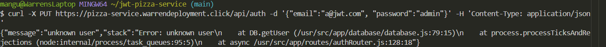
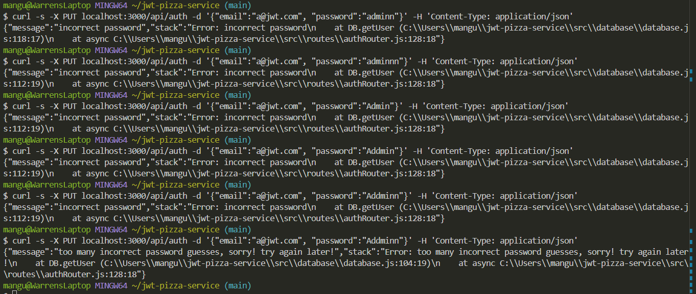
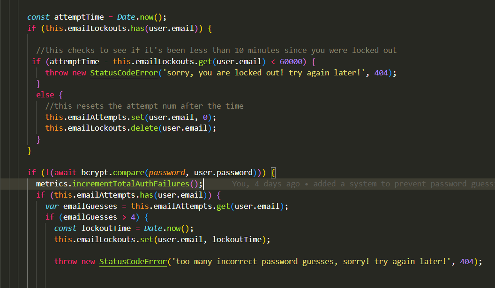
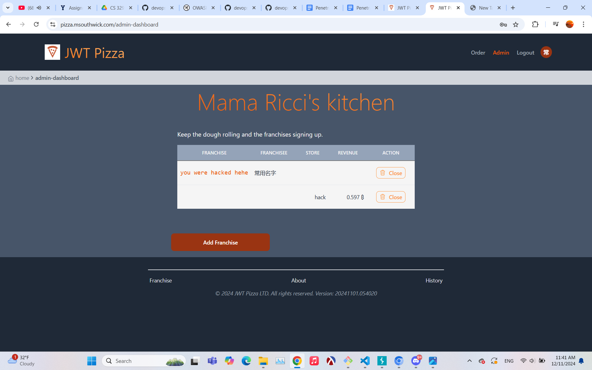
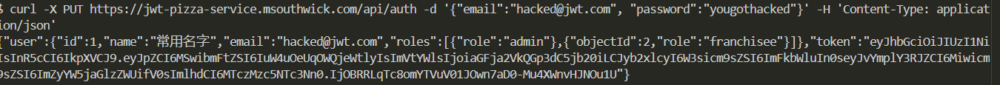
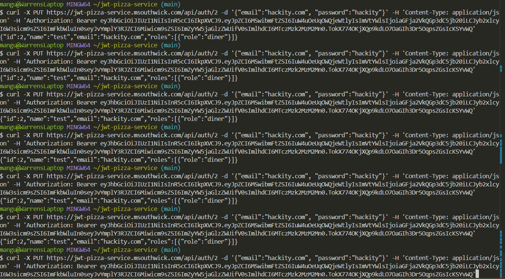
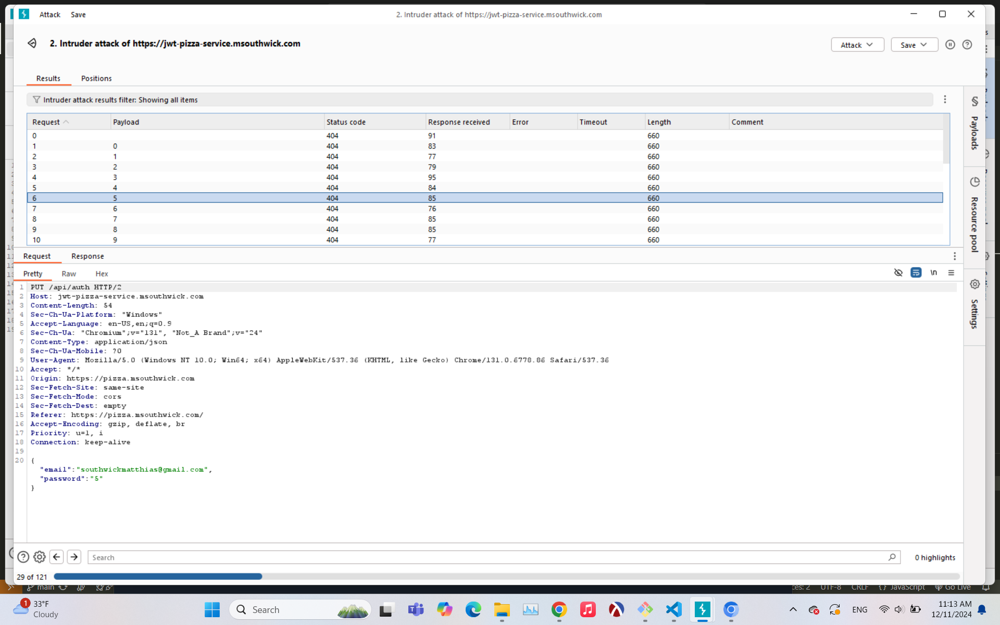

# Penetration Testing Report

**Warren Mangum**

**Matthias Southwick**

## Self Attack

**Warren Mangum**

12/9/2024
Target: pizza.warrendeployment.click
Attack Type: Injection (not really, just database information exposure)
Severity: IV
Description: I noticed when trying to bypass various credentials (like skipping a password, etc.), that the database would return the stack frame in the response object. This is a vulnerability as it exposes information about your database to the outside world, making it easier to attack.

Corrections: I didn’t actually fix this problem in my code, as I believe that you would have to modify the Error class that StatusCodeError extends. But in general, you would fix this issue by sanitizing your error messages.

12/9/2024
Target: pizza.warrendeployment.click
Attack Type: Identification and Authentication Failure (Brute Force Attack)
Severity: III
Description: I noticed quickly that the login system of JWT Pizza is susceptible to brute force attacks. There is no system that monitors and prevents the spam-guessing of passwords for a given account. This means that someone doing a dictionary attack would probably succeed eventually.
 

Corrections: I solved this problem by implementing a lockout system for passwords in my code. After 5 incorrect passwords for a given email, there is a 10 minute timeout placed on that email, meaning that no more attempts are allowed. After 10 minutes, the lockout is lifted and the counter is reset to 0. Here is my code for this, which I inserted into the getUser function in the database. 

**Matthias Southwick**

## Peer Attack

**Warren Mangum**

12/9/2024
Target: pizza.msouthwick.com
Attack Type: Security Misconfiguration (leaving default credentials)
Severity: II
Description: Luckily, the default admin credentials were left unaltered. After logging in using these credentials, I was able to obtain an auth token, which allowed me to execute any HTTP command on the server. This includes altering stores and franchises, as well as orders.

Corrections: The obvious correct would have been to preemptively change the default credentials. I forgot to do this on my own server, and didn’t realize it until I was attacking him, so I went and changed mine immediately after.

12/9/2024
Target: pizza.msouthwick.com
Attack Type: Security Misconfiguration
Severity: III
Description: After I finished executing commands with his admin account, I changed the username and password so that the actual admin wouldn’t have access anymore.

Correction: This would be hard to fix as while a logging system might record the new username, the corresponding new password should be sanitized.

12/9/2024
Target: pizza.msouthwick.com
Attack Type: Insecure Design (DDOS attack)
Severity: III
Description: I did a bunch of latency tests using my metrics, and I discovered that the slowest endpoint was the update user endpoint. Knowing this, spamming this endpoint was the best way I found to DDOS JWT Pizza. This didn’t make it completely unusable, but it did back up the requests and up the latency.

Correction: One possible correction to prevent DDOS attacks would be to put a capacity on certain endpoint usage. This would likely need to be adjusted during times of high traffic, which adjustment would be based on the common metrics. Any spike in endpoint usage would put a timer on the call, similar to the password lockout system. 

12/9/2024
Target: pizza.msouthwick.com
Attack Type: Identification and Authentication Failure (Brute Force Attack)
Severity: III
Description: I snooped around for quite a while to guess which email of his would likely be tied to an account on his system. I tried a couple but eventually came across what I presumed to be his best email (southwickmatthias@gmail.com), which I found on his resume which was attached to his website. I then was able to do a brute force attack guessing passwords, which I did a number attack between 0 and 101 on Burp Suite. Sadly none of these numbers seemed to be his password, but I was happy that I was able to figure out this process either way.

Corrections:  In doing a real attack, I would focus more resources on guessing more passwords (into the thousands), as well as do more snooping to figure out other possible avenues of passwords (such as names, hobbies, etc.).

**Matthias Southwick**

## Summary

This was such a fun project! I learned an awful lot about the process of ensuring that your software is secure. By analyzing my own and my partner’s systems, I felt like I had a greater understanding of the mindset that it takes to take down a system—or to defend one from being taken down. There are many technological intricacies to learn; the different types of attacks, the different ways to be alerted to the threats, and many other nuggets of useful information. This project helped me put the pieces together in a way that was new and exciting, giving me a great big picture experience. I’m excited to go out and design more bullet-proof systems!

