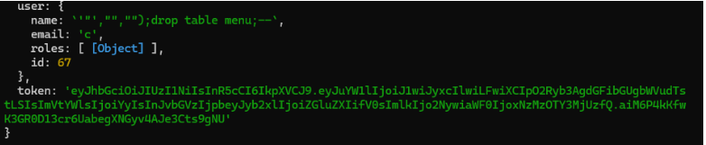
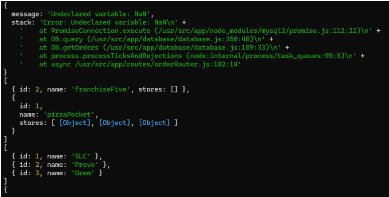
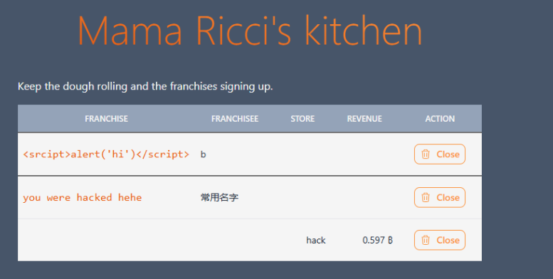
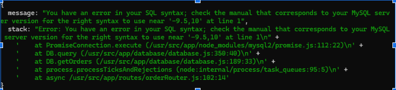
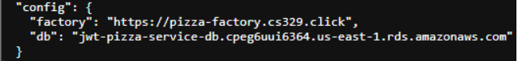
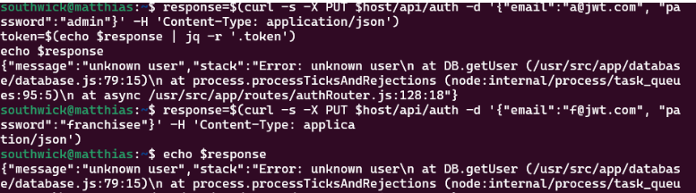

# Penetration Testing Report

**Warren Mangum**

**Matthias Southwick**

## Self Attack

**Warren Mangum**

12/9/2024

Target: pizza.warrendeployment.click

Attack Type: Injection (not really, just database information exposure)

Severity: IV

Description: I noticed when trying to bypass various credentials (like skipping a password, etc.), that the database would return the stack frame in the response object. This is a vulnerability as it exposes information about your database to the outside world, making it easier to attack.

Corrections: I didn’t actually fix this problem in my code, as I believe that you would have to modify the Error class that StatusCodeError extends. But in general, you would fix this issue by sanitizing your error messages.

---

12/9/2024

Target: pizza.warrendeployment.click

Attack Type: Identification and Authentication Failure (Brute Force Attack)

Severity: III

Description: I noticed quickly that the login system of JWT Pizza is susceptible to brute force attacks. There is no system that monitors and prevents the spam-guessing of passwords for a given account. This means that someone doing a dictionary attack would probably succeed eventually.
 

Corrections: I solved this problem by implementing a lockout system for passwords in my code. After 5 incorrect passwords for a given email, there is a 10 minute timeout placed on that email, meaning that no more attempts are allowed. After 10 minutes, the lockout is lifted and the counter is reset to 0. Here is my code for this, which I inserted into the getUser function in the database. 

**Matthias Southwick**

I had an interesting experience when I went to hack myself. I was not able to start this assignment until Dec 10, and when I went to change my credentials,  the default admin username and password had already been changed!

Knowing that my partner had already hacked me made me much less motivated to try fixing my website.

Possible vulnerabilities:

Many of the vulnerabilities are only accessible if you already have admin credentials, so I would start by modifying the default username and password. In fact, I generally like to have sql access to my own database, and this project kind of disallowed that.

Attempt to penetrate you deployment of JWT Pizza. 

I tried several different sql injection attacks on my own server, including creating a user that if not parameterized would drop the menu table

 I also tried doing a second injection, however the value happened to be added to a different value so, I got NaN value. If not for this I suspect it would have worked. 

I tried some XSS attacks, specifically where you put html fields as franchise names or user names, but this didn’t really work

## Peer Attack

**Warren Mangum**

12/9/2024

Target: pizza.msouthwick.com

Attack Type: Security Misconfiguration (leaving default credentials)

Severity: II

Description: Luckily, the default admin credentials were left unaltered. After logging in using these credentials, I was able to obtain an auth token, which allowed me to execute any HTTP command on the server. This includes altering stores and franchises, as well as orders.

Corrections: The obvious correct would have been to preemptively change the default credentials. I forgot to do this on my own server, and didn’t realize it until I was attacking him, so I went and changed mine immediately after.

---

12/9/2024

Target: pizza.msouthwick.com

Attack Type: Security Misconfiguration

Severity: III

Description: After I finished executing commands with his admin account, I changed the username and password so that the actual admin wouldn’t have access anymore.

Correction: This would be hard to fix as while a logging system might record the new username, the corresponding new password should be sanitized.

---

12/9/2024

Target: pizza.msouthwick.com

Attack Type: Insecure Design (DDOS attack)

Severity: III

Description: I did a bunch of latency tests using my metrics, and I discovered that the slowest endpoint was the update user endpoint. Knowing this, spamming this endpoint was the best way I found to DDOS JWT Pizza. This didn’t make it completely unusable, but it did back up the requests and up the latency.

Correction: One possible correction to prevent DDOS attacks would be to put a capacity on certain endpoint usage. This would likely need to be adjusted during times of high traffic, which adjustment would be based on the common metrics. Any spike in endpoint usage would put a timer on the call, similar to the password lockout system. 

---

12/9/2024

Target: pizza.msouthwick.com

Attack Type: Identification and Authentication Failure (Brute Force Attack)

Severity: III

Description: I snooped around for quite a while to guess which email of his would likely be tied to an account on his system. I tried a couple but eventually came across what I presumed to be his best email (southwickmatthias@gmail.com), which I found on his resume which was attached to his website. I then was able to do a brute force attack guessing passwords, which I did a number attack between 0 and 101 on Burp Suite. Sadly none of these numbers seemed to be his password, but I was happy that I was able to figure out this process either way.

Corrections:  In doing a real attack, I would focus more resources on guessing more passwords (into the thousands), as well as do more snooping to figure out other possible avenues of passwords (such as names, hobbies, etc.).

**Matthias Southwick**

12/11/2024

Target https://pizza-service.warrendeployment.click

Classification: SQL INJECTION ATTACK

Severity: 4

I tried a few different attacks. There were several database calls that did not have parameterized values in the SQL code. 

This included the getOrders() function which did not parameterize the LIMIT value, so by calling the /api/order?page=.05 endpoint, I was able to get information from the call stack that revealed the internal working of the server. 

While this attack was not able to do any damage to the database, the errors could be sanitized.

---

12/11/2024

Target https://pizza-service.warrendeployment.click

Classification: Broken Access Control

Severity: 4

Target https://pizza-service.warrendeployment.click

Database server identified

Remove database url from the public config.

Additionally I tried checking all the default passwords, and they had all been changed.

## Summary

This was such a fun project! I learned an awful lot about the process of ensuring that your software is secure. By analyzing my own and my partner’s systems, I felt like I had a greater understanding of the mindset that it takes to take down a system—or to defend one from being taken down. There are many technological intricacies to learn; the different types of attacks, the different ways to be alerted to the threats, and many other nuggets of useful information. This project helped me put the pieces together in a way that was new and exciting, giving me a great big picture experience. I’m excited to go out and design more bullet-proof systems!

This was a very good learning experience. I was able to learn about what things make secure software, and about different attacks. I got hacked first, and I realized that I should have changed the default password a long time ago. Hacking a system that was prepared was a lot more difficult, and it really shows the importance of making sure your system is prepared. Overall, pen testing is a very interesting subject, and something I am glad I have learned about in this class.

